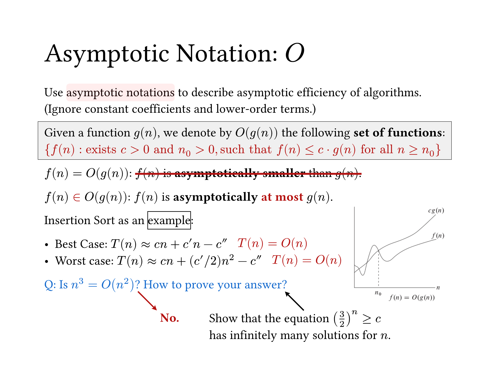
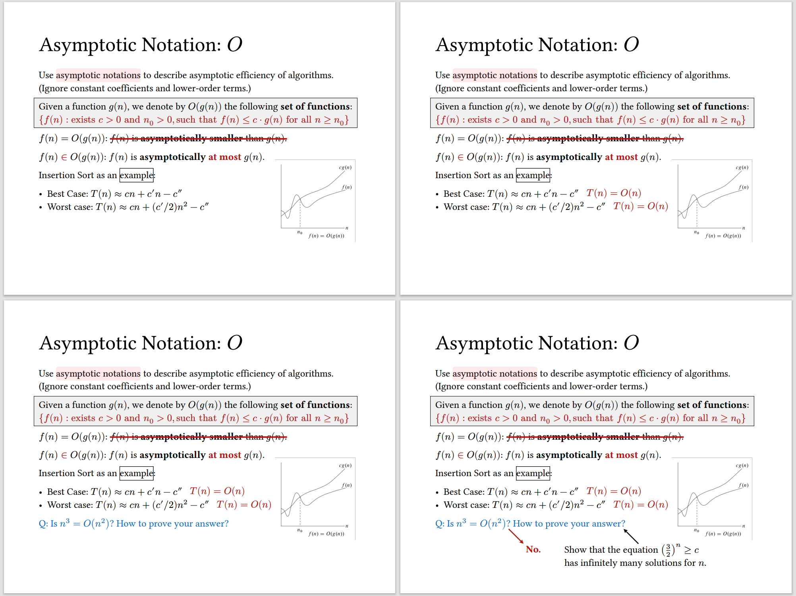

# Pinup

Pin things as you like, especially useful for creating slides.

## Example

### Pin things as you like

Have a look at the source [here](./examples/example.typ).



### Dynamic Slides

Have a look at the pdf file [here](./examples/example.pdf).




## Usage

The idea of pinup is pinning pins on the normal flow of the text, and then placing the content on the page by `absolute-place` function.

For example, we can highlight text by pins and add a tip:

```typ
#import "@preview/pinup:0.1.0": *

#set text(size: 24pt)

A simple #pin(1)highlighted text#pin(2).

#pinup-highlight(1, 2)

#pinup-point-from(2)[It is simple.]
```


## Reference

### `pin`

Pinning a pin in text, the pin is supposed to be unique in one page.

```typ
#let pin(name) = { .. }
```

**Arguments:**

- `name`: [`any`] &mdash; Name of pin, which can be any types with unique `repr()` return value, such as integer and string.


### `pinup`

Query positions of pins in **the same page**, then call the callback function `func`.

```typ
#let pinup(pins, func) = { .. }
```

**Arguments:**

- `pins`: [`any` or `array`] &mdash; Names of pins you want to query. It is supposed to be a pin, or an array of pins.
- `func`: [`(positions) => { .. }`] &mdash; A callback function accepting an array of positions (or a single position) as parameter. Each position is a dictionary like `(page: 1, x: 319.97pt, y: 86.66pt)`. You can use `absolute-place` function in this callback function to display something around the pins.

**Returns:** [`content`] &mdash; The return value of callback function.

### `absolute-place`

Place content at a specific location on the page relative to the top left corner of the page, regardless of margins, current container, etc.

> This function come from [typst-drafting](https://github.com/ntjess/typst-drafting).

```typ
#let absolute-place(
  dx: 0em,
  dy: 0em,
  content,
) = { .. }
```

**Arguments:**

- `dx`: [`length`] &mdash; Length in x-axis relative to the left edge of the page.
- `dy`: [`length`] &mdash; Length in y-axis relative to the top edge of the page.
- `content`: [`content`] &mdash; The content you want to place.

**Returns:** [`content`] &mdash; The content you placed passing through `locate` and `place` function.